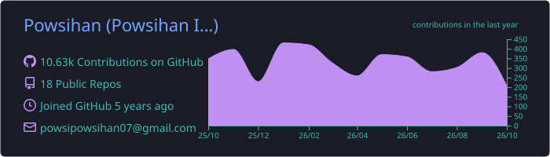
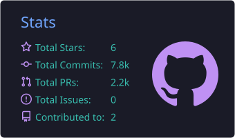
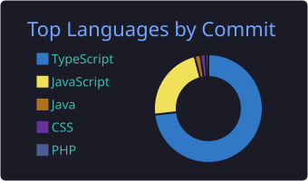

<h1 align="center">Hi 👋, I'm Powsihan</h1>

  

<h3 align="center">Software Engineer from Sri Lanka 🇱🇰 · Crafting fast, beautiful & accessible web interfaces</h3>

  
  
  

---

## 🙋‍♂️ About Me

- 🎓 Graduated with **First Class Honours** in **Computer Science and Technology** from **Uva Wellassa University**

- 💻 **Software Engineer** working across the full stack, with deep expertise in **frontend development**

- 🎨 I build **pixel-perfect, responsive and accessible** UIs from design to production

- ⚡ Obsessed with **performance, clean component architecture** and smooth user experiences

- 💬 Ask me about **React, Next.js, TypeScript and UI/UX**

- 📫 Reach me at **powsihan.dev@gmail.com**

- 😄 Fun fact: **I am funny**

 

---

## 🎨 Frontend Mastery

  
   
  

<table align="center">
  <tr>
    <td align="center" width="25%">🧩 <b>Component Architecture</b> Reusable, scalable UI systems</td>
    <td align="center" width="25%">🔄 <b>State Management</b> Redux & predictable data flow</td>
    <td align="center" width="25%">📱 <b>Responsive & Accessible</b> Every screen, every user</td>
    <td align="center" width="25%">🚀 <b>Performance</b> Fast loads, smooth interactions</td>
  </tr>
</table>

## ⚙️ Backend, Cloud & Databases

  

## 🛠️ Tools & Design

  

---

## 📊 GitHub Stats

  

  
  

  

---

## 🤝 Connect with Me

  
  
  
  
  
  
  

<i>⭐ Thanks for stopping by! Let's build something great together.</i>

